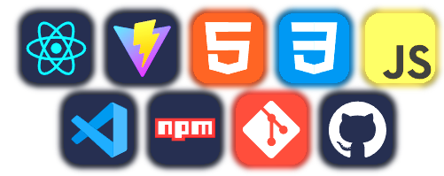

<h3>API HUB BRASIL</h3>
Aplicação front-end desenvolvida em React-vite, para atender o projeto final do curso Mais Pra TI Fullstack Jr. 
A proposta do API HUB BRASIL é disponibilizar de forma centralizada um catálogo de apis em idioma Português e gratuitas.

<h3>Tecnologias e Ferramentas utilizadas no FrontEnd</h3>

<h3>Time Responsável pelo Projeto</h3>
O projeto foi idealizado e desenvolvido por estes desenvolvedores fantásticos: 
<h3><a href="https://github.com/ThiagoCS0">Thiago C. Silva</a> | <a href="https://github.com/rodrigosv91">Rodrigo Vieira</a> | <a href="https://github.com/RafaelaOMarques">Rafaela Marques</a> </h3>

